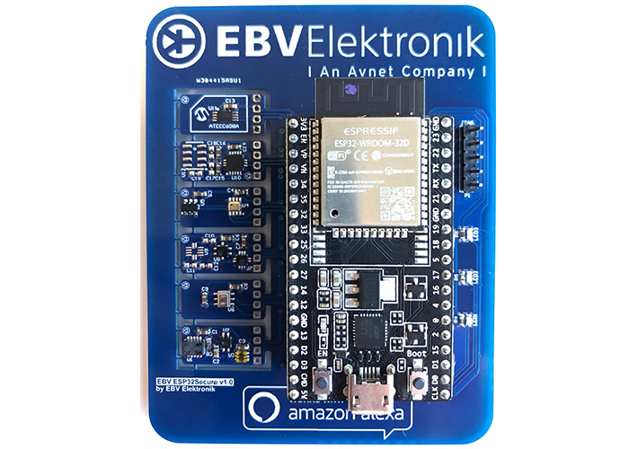

# EBV ESP32Secure kit 

In 2020, the Avnet company EVB Elektronik released training kit specifically designed for adding a security (hardware) layer on top of the well known ESP32 DevKitC V4. This layer is indeed handled by the Microchip ATECC608A secure element, that offers an hardware-based secure storage. **Besides to that, the kit comes with 5 other PCBs, providing 11 sensors very useful for plenty of IoT applications.**

For unknown reasons, the kit disapperead from the Internet (the company blog posts on that have been deleted too), and now it is very hard to find any information about it. As of Jan 2025, the only reference to this is an old wonky [EBV website](https://www.iotconnect.io/ebv/), where the kit is still listed, but the links are broken. _The image above shows the kit, as it was presented there._

This repository aims to provide a complete documentation of the kit, and to offer a starting point for those who want to use it even if I don't think it is possible to find it anymore.

## Sensors and PCBs

_The checked sensors have been already implemented._

### Sensor PCB 1 (*NXP Semiconductors*)

- [ ] **FXOS8700CQ** – a 6-axis sensor with an integrated linear accelerometer and magnetometer.
- [ ] **PCT2075DP** – a high-accuracy digital temperature sensor and thermal watchdog.

### Sensor PCB 2 (*Infineon*)

- [ ] **DPS422** – a digital XENSIV™ barometric pressure and temperature sensor for portable and IoT devices.
- [ ] **TLV493D** – a 3D magnetic sensor with low power consumption.

### Sensor PCB 3 (*STMicroelectronics*)

- [ ] **LPS22HB** – an absolute digital output barometer with a pressure range from 260 to 1260 hPa.
- [x] **HTS221** – a capacitive digital sensor for relative humidity and temperature.
- [ ] **LSM303AGR** – a high-performance eCompass module: an ultra-low-power 3D accelerometer and a 3D magnetometer.

### Sensor PCB 4 (*Renesas*)

- [x] **HS3001** – a high-performance relative humidity and temperature sensor.

### Sensor PCB 5 (*ams*)

- [x] **CCS811** – an ultra-low-power digital gas sensor for indoor air quality monitoring.
- [ ] **ENS210** – a highly accurate relative humidity and temperature sensor.
- [ ] **TSL2572** – a light-to-digital converter.

## Software and libraries  

The project has been developed using the [PlatformIO](https://platformio.org/) IDE.